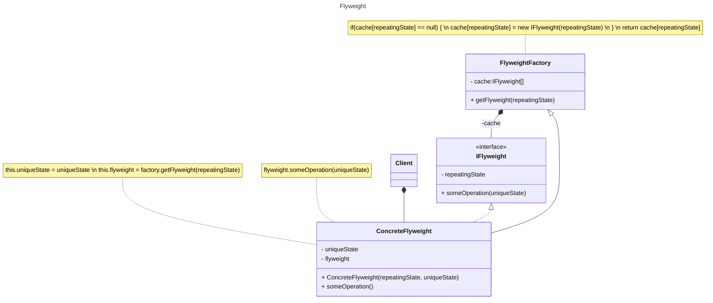

****
# :star2:  `Flyweight`

### :black_nib:	Призначення та застосування шаблону
#### **Легковаговик** — це структурний патерн проектування, що дає змогу вмістити більшу кількість об’єктів у відведеній оперативній пам’яті. Шаблон заощаджує пам’ять, розподіляючи спільний стан об’єктів між собою, замість зберігання однакових даних у кожному об’єкті.
###### Flyweight використовує спільний доступ для ефективної підтримки великої кількості об’єктів. Сучасні **веб-браузери** використовують цю техніку, щоб запобігти завантаженню однакових зображень двічі. 
###### Браузер завантажує всі нові зображення з Інтернету та поміщає їх у внутрішній кеш. Для вже завантажених зображень створюється важливий об’єкт, який має деякі унікальні дані, наприклад положення на сторінці, але все інше посилається на кешований.
#### **Застосовується :**
- коли у програмі використовується **велика кількість об’єктів**;
- через це **високі витрати оперативної пам’яті**;
- коли **більшу частину стану об’єктів можна винести за межі їхніх класів**;
- коли **великі групи об’єктів можна замінити невеликою кількістю об’єктів,** що розділяються, оскільки зовнішній стан винесено.

### Діаграми класів та стану

##### Class Diagram Flyweight:

##### State Diagram Flyweight:

### Опис основних структурних елементів :
- **FlyweightFactory** керує створенням і повторним використанням flyweight. Фабрика отримує запити, в яких зазначено бажаний стан. Якщо flyweight з таким станом вже створено, фабрика відразу його повертає, а якщо ні — створює новий об’єкт;
- **IFlyweight** інтерфейс, що містить ***внутрішній стан***, який повторювався в багатьох первинних об’єктах;
- **ConcreteFlyweight** містить ***зовнішній стан***, унікальний для кожного об’єкта;
- **Client** обчислює або зберігає concreteFlyweigh.

###### На діаграмі станів зображено конкретну реалізацію шаблону проекту C# Visual Studio для створення малюнку з лініями та овалами.

### Джерела інформації:
##### - [refactoring.guru](https://refactoring.guru/design-patterns/flyweight)
##### - [sourcemaking.com](https://sourcemaking.com/design_patterns/flyweight)
##### - [medium.com](https://medium.com/@rajeshvelmani/lightweight-objects-for-efficient-performance-exploring-the-flyweight-design-pattern-in-java-4595ebfa3165)
##### - [www.digitalocean.com](https://www.digitalocean.com/community/tutorials/flyweight-design-pattern-java)
****
